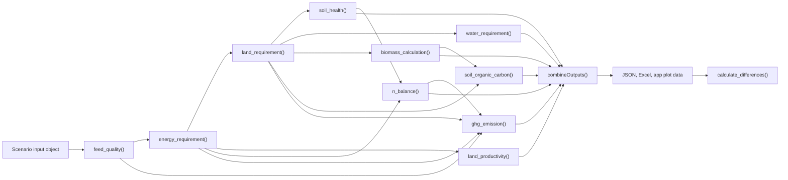

# cleaned

`cleaned` implements the iCLEANED model: inclusive Comprehensive Livestock Environmental Assessment for Improved Nutrition, a Secured Environment, and Sustainable Development along livestock and fish value chains.

The package estimates environmental indicators for livestock production systems from a structured scenario input object. It is used in two main workflows:

- **Interactive app workflow**: the iCLEANED Shiny app builds scenarios, passes them into the package, and uses compact app-facing outputs for result tables and interactive plots.
- **Batch workflow**: scripts process one or more scenario JSON files, write detailed JSON and Excel outputs, and compare scenarios using standardized indicators.

## What the Package Calculates

The core model pipeline links feed, livestock, soil, water, and greenhouse gas modules:



The main indicators include:

- Feed quality and feed allocation by livestock class and season.
- Energy, protein, dry matter intake, manure, and livestock productivity.
- Land and dry matter requirements for on-farm feeds, off-farm roughages, off-farm concentrates, and imported concentrates.
- Soil erosion, nitrogen balance, biomass carbon change, and soil organic carbon change.
- Water use by feed item and product.
- Greenhouse gas emissions from enteric fermentation, manure, soils, fertilizer, burning, rice, and off-farm feed production.
- Scenario comparison indicators for GHG emissions, land, nitrogen balance, erosion, water, carbon stock change, and food/protein output.

## Installation

Install from a local checkout:

```r
install.packages("remotes")
remotes::install_local("path/to/cleaned")
```

Or install from a tagged GitHub release:

```r
remotes::install_github("CIAT/cleaned@cleaned_v0.6.1")
```

For development on Windows, verify the package with:

```powershell
R CMD INSTALL .
Rscript -e "library(cleaned); packageVersion('cleaned')"
```

## Runtime Requirements

The package requires R >= 4.0.0 and imports:

- `jsonlite`
- `tidyverse`
- `data.table`
- `lubridate`
- `plyr`
- `tidyr`
- `dplyr`
- `tibble`
- `utils`
- `rlang`
- `stringr`
- `ggplot2`
- `openxlsx`

Suggested packages for testing and documentation are `testthat`, `knitr`, `rmarkdown`, and `spelling`.

The iCLEANED app has additional dependencies outside this package. In particular, interactive plotting uses `ggiraph`; when the app uses `ggplot2 4.x`, use `ggiraph 0.9.6` or newer.

## Input Object

Most exported functions use a nested scenario object named `para`. It can be built from JSON or from the app's scenario builder. At minimum, a full model run expects these sections:

- `livestock`: livestock category, herd composition, weight, growth, milk, manure management, nutrient, and IPCC category fields.
- `seasons`: season names and lengths.
- `feed_items`: feed nutrient composition, crop/feed production parameters, fertilizer application, water coefficients, erosion parameters, and biomass/SOC fields.
- `feed_basket`: feed allocations by season and livestock category.
- `fertilizer`: fertilizer descriptions and nitrogen content. Empty fertilizer data are accepted by some modules.
- Farm, climate, soil, land-use, manure import, and product waste scalar fields.
- External parameter lists: energy parameters, GHG/IPCC parameters, and stock change parameters.

For feed nutrient composition, the minimum fields needed by `feed_quality()` are:

- `dm_content`: dry matter content, percent of fresh matter.
- `me_content`: metabolizable energy using the package's feed database basis.
- `cp_content`: crude protein, percent of dry matter.

The full pipeline needs additional agronomic and spatial fields because land, nitrogen, water, soil, and biomass modules depend on crop yield, residue, slope, soil, evapotranspiration, precipitation, fertilizer, and tree parameters.

See [Input Contract](vignettes/input-contract.Rmd) for the detailed field reference and unit notes.

## Standard Model Run

```r
library(cleaned)
library(jsonlite)

para <- fromJSON("scenario_input.json")
energy_parameters <- fromJSON(system.file("extdata", "energy_parameters.json", package = "cleaned"))
ghg_parameters <- fromJSON(system.file("extdata", "ghg_parameters.json", package = "cleaned"))
stock_change_parameters <- fromJSON(system.file("extdata", "stock_change_parameters.json", package = "cleaned"))

feed_basket_quality <- feed_quality(para)
energy_required <- energy_requirement(para, feed_basket_quality, energy_parameters)
land_required <- land_requirement(feed_basket_quality, energy_required, para)
soil_erosion <- soil_health(para, land_required)
nitrogen_balance <- n_balance(para, land_required, energy_required, soil_erosion)
water_required <- water_requirement(para, land_required)
livestock_productivity <- land_productivity(para, energy_required)
biomass <- biomass_calculation(para, land_required)
soil_carbon <- soil_organic_carbon(para, stock_change_parameters, land_required, biomass)
ghg_emissions <- ghg_emission(
  para,
  energy_required,
  ghg_parameters,
  land_required,
  nitrogen_balance,
  feed_basket_quality
)

outputs <- combineOutputs(
  para,
  feed_basket_quality,
  energy_required,
  land_required,
  soil_erosion,
  water_required,
  nitrogen_balance,
  livestock_productivity,
  biomass,
  soil_carbon,
  ghg_emissions,
  filePath = "scenario_output.json"
)
```

## Output Structure

`combineOutputs()` writes an Excel workbook and returns a list that supports both app and batch workflows.

App-facing outputs:

- `json_output`
- `on_farm_table`
- `nitrogen_balance`
- `land_required`
- `water_use_per_feed_item`

Batch-facing outputs:

- Detailed land, dry matter, soil, nitrogen, water, livestock productivity, manure, biomass, soil carbon, product waste, and GHG tables.
- Full Excel sheets for intermediate results and diagnostics.

`calculate_differences()` reads one or more scenario output JSON files and writes:

- A comparison JSON file.
- `runs_comparison.xlsx` with an `all_results` sheet.
- One row per scenario with scalar indicators suitable for plotting and comparison.

See [Output Contract](vignettes/output-contract.Rmd) for the detailed output reference.

## Documentation

The documentation set is organized as:

- [Model Overview](vignettes/cleaned-overview.Rmd)
- [Input Contract](vignettes/input-contract.Rmd)
- [Output Contract](vignettes/output-contract.Rmd)
- [Developer Guide](vignettes/developer-guide.Rmd)

Function-level help is available in R:

```r
?feed_quality
?combineOutputs
?calculate_differences
```

## Development Checks

Before pushing calculation or output changes:

```powershell
Rscript -e "parse(file='R/differences.R')"
Rscript -e "for (f in list.files('R', pattern='\\.R$', full.names=TRUE)) parse(file=f)"
R CMD INSTALL .
```

Recommended full package check:

```powershell
R CMD check --no-manual .
```

For app compatibility, install the local package into the app test library and confirm:

```r
library(cleaned)
find.package("cleaned")
packageVersion("cleaned")
```

The path should point to the intended local or released package version.

## Repository Layout

```text
R/                 exported model functions and helpers
man/               generated function documentation
vignettes/         professional user and developer documentation
inst/extdata/      bundled model parameter JSON files and example input
data/              packaged example data and parameter artifacts
tests/testthat/    automated tests
```

## Citation

Use the package citation metadata in `CITATION.cff` when citing the software.
